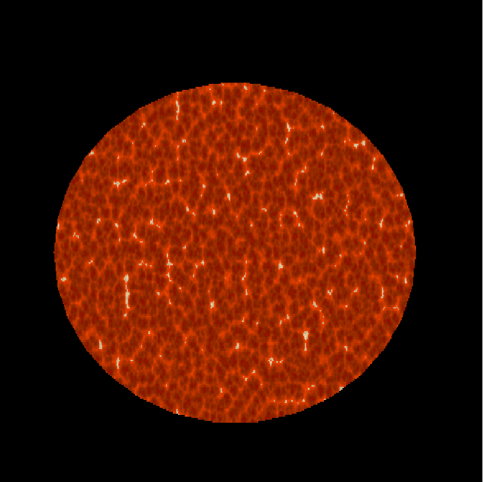
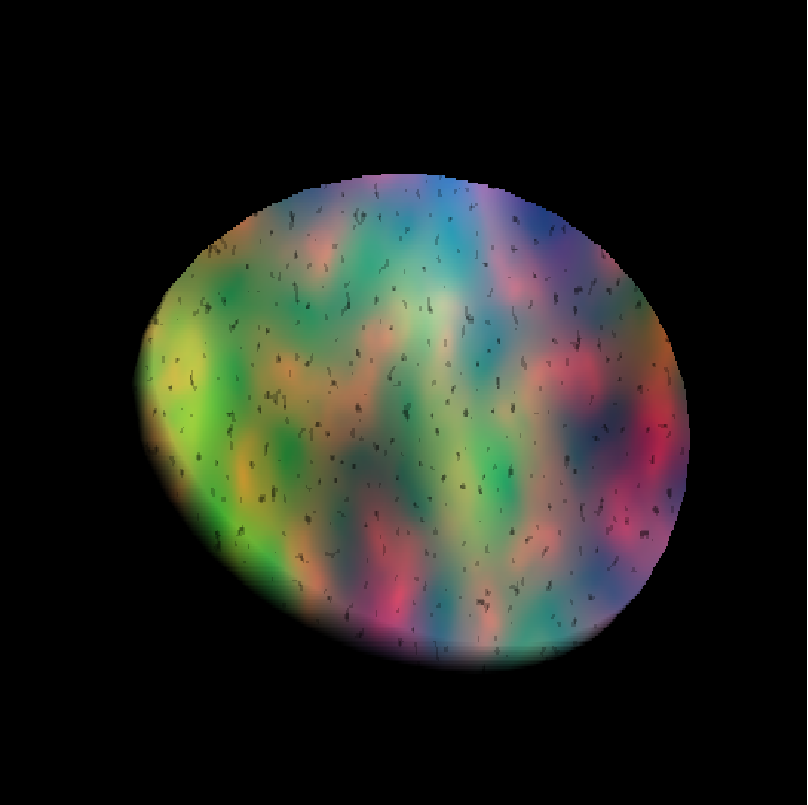
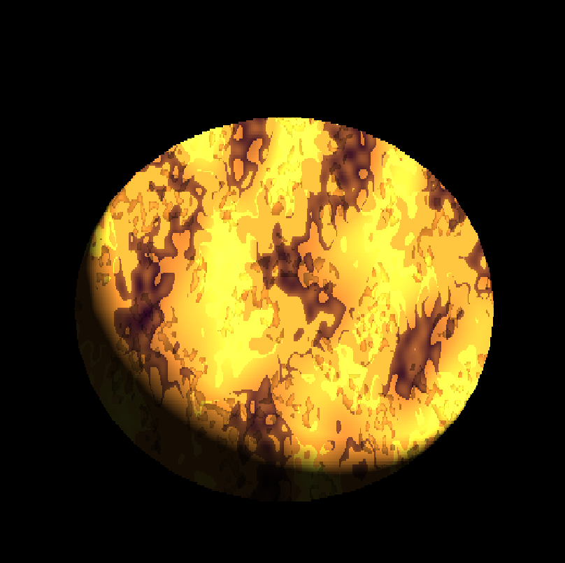
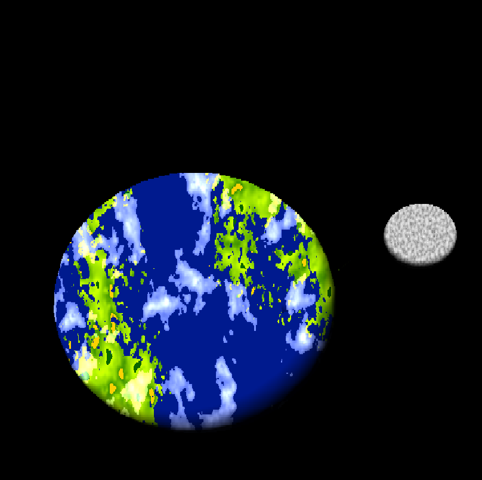
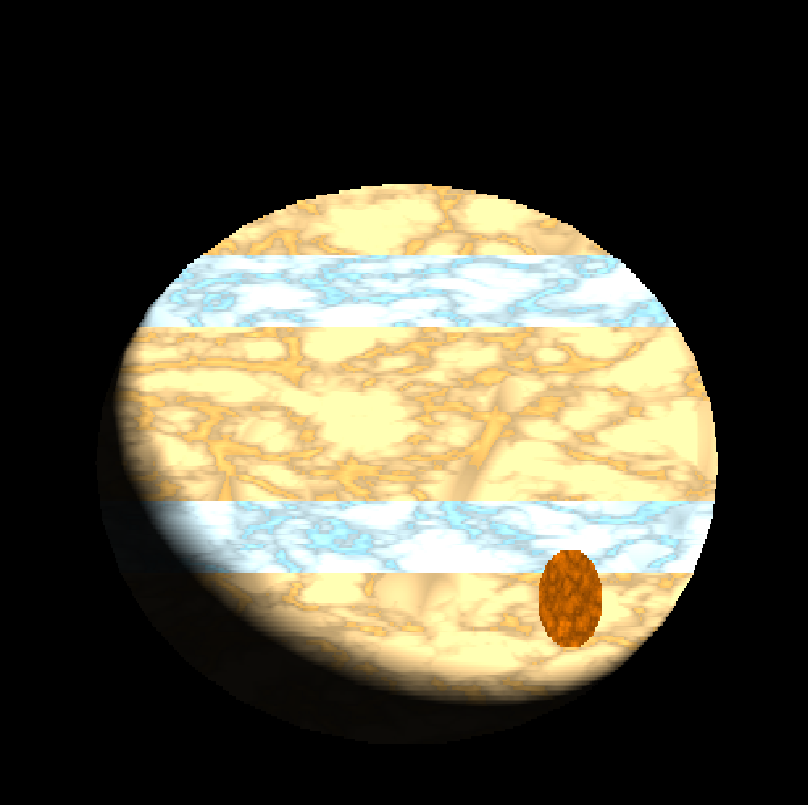
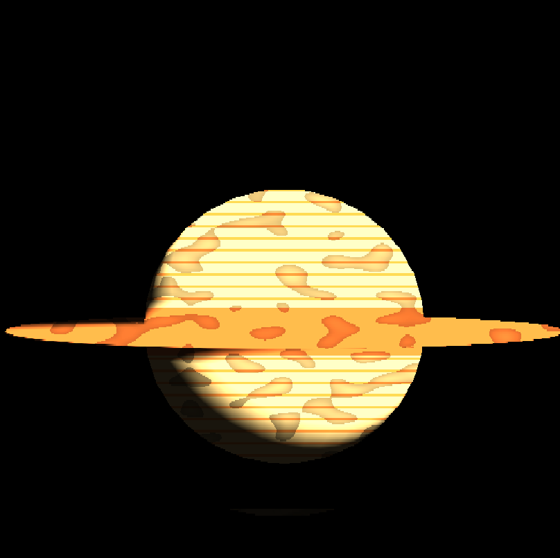
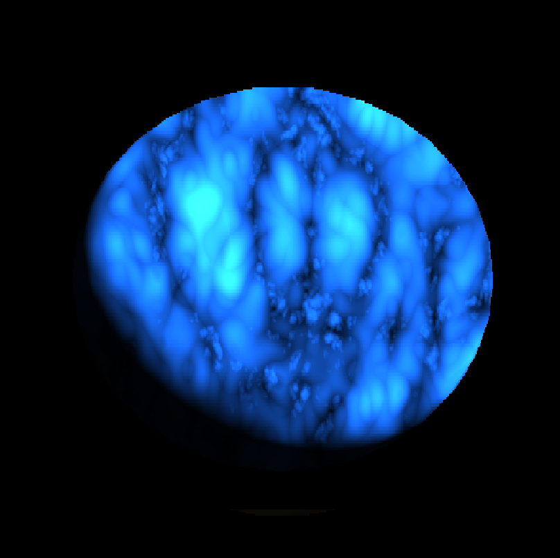

# Rendering Pipeline with Custom Sahders: Planet Viewer

This repository contains various implementations of custom shaders, using techniques such as horizontal sprites, color blending and several noise-arrays to obtain interesting textures.

As a way to display the possibility of these shaders, in this project there arae 6 planets and a star (based on the solar system) all of them with unique shader implementations to simulate their real life topology.

As a note, its worth mentioning that some liberties were taken for aesthetic purposes.

## Planet Display
### 1. Sun
Press the "1" key to sho
w the this planet

### 2. Mercury
Press the "1" key to show the this planet

### 3. Venus
Press the "1" key to show the this planet

### 4. Earth
Press the "1" key to show the this planet

### 5. Jupiter
Press the "1" key to show the this planet

### 6. Saturn
Press the "1" key to show the this planet

### 7. Neptune
Press the "1" key to show the this planet
